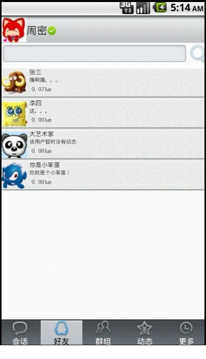
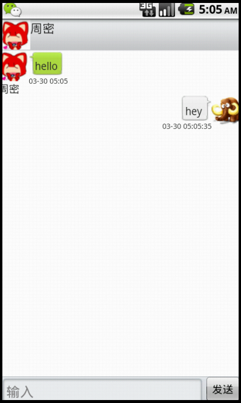

# Medium_08_SMS
2013 年校级科研项目

# 关于

项目使用了LBS服务、GPS定位和Google Map技术，实现了即时通信软件的基本功能，具体包括：

1、好友管理，用户可以添加或删除好友。

2、动态管理，用户可发表签名好友可以看到。

3、定位管理，通过位置服务获得地理位置信息并可查看好友位置信息。

4、即时通讯，用户通过添加好友，可以与好友进行实时的聊天。

# 系统效果

